# FlagGame

> **2025년 HARMAN Semicon Academy 1기** <br/> **개발기간: 2025.06.03 ~ 06.12**

## 개발팀 소개

|박호윤                                          |박지수                                            |임윤재                                         |함영은                                      |                                                                               
| :--------------------------------------------: | :--------------------------------------------:     | :---------------------------------------:       | :---------------------------------------: |
|   [@cong2738](https://github.com/cong2738)     |    [@Friday930](https://github.com/Friday930)      | [@immune](https://github.com/immune1029)        | [@heyhoo46](https://github.com/heyhoo46)  |
|SystenArchitecture Design And GAME LOGIC Circuit Develop           |ISP Develop and SIM,VGA Print module develop And SIM|camera communication develop and Game font design|GAME UI design, Graphic Circuit develop, GameLogic SIM|

## Introduce

- ImageSerchingAndDetect  
FPGA 기반으로 실시간 카메라 영상을 처리하고, 사용자의 깃발 동작을 인식해 반응하는 청기백기 게임을 구현한다. 카메라에서 입력된 원시 영상은 직접 구현한 ISP 회로를 통해 밝기 보정과 노이즈 제거 등 전처리를 거친다. 이후 ROI(Region of Interest) 영역에서 조건에 부합하는 픽셀의 개수를 카운트하여, 깃발의 색상과 위치를 판별한다.<br/>
HSV 변환이나 색상 분리 없이 RGB 조건만으로 픽셀을 분류하고, 각 영역에서의 개수를 비교함으로써 사용자의 동작을 인식한다. 전 과정은 순수 하드웨어(FPGA) 로직으로 구성되어, 외부 CPU 개입 없이 고속으로 처리된다. FSM 기반 제어 로직을 통해 게임 판정 및 화면 출력까지 실시간으로 수행한다.<br/>

## Stacks

### Environment


### Development


### SYSTEM
</br>

## SystenArchitecture
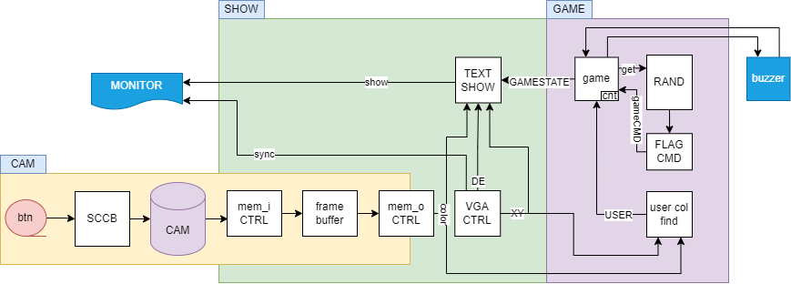</br>

### Cam Block
- Block Design</br>
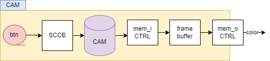</br>
#### Module Overview
##### VGA
   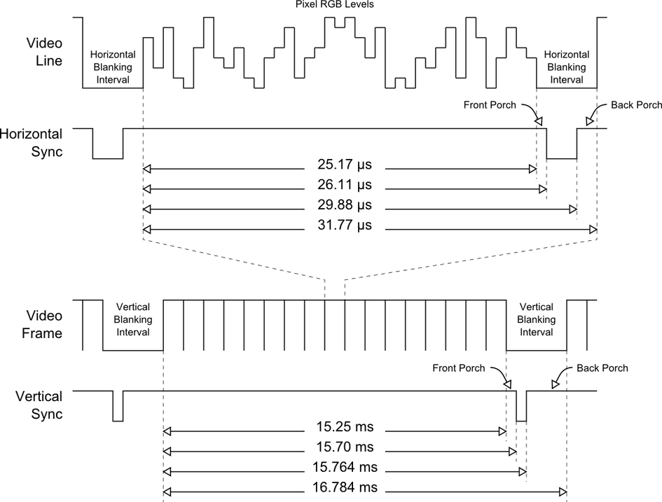</br>
   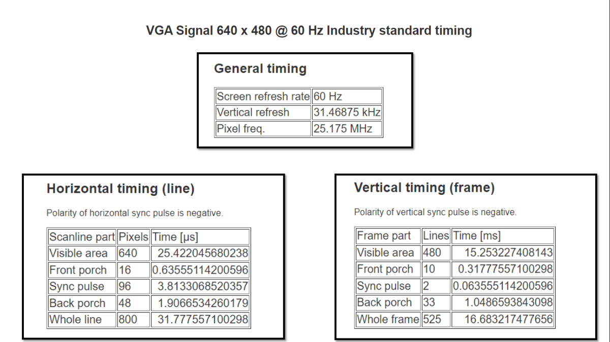</br>
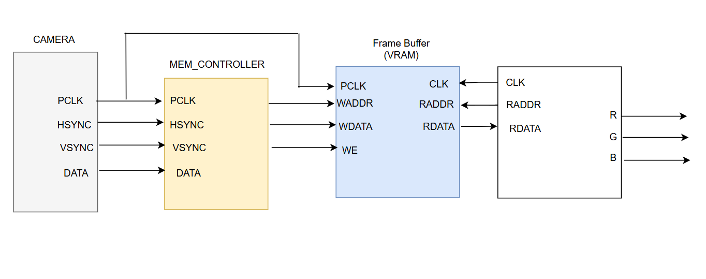</br>  

##### CAM
- SCCB</br>
   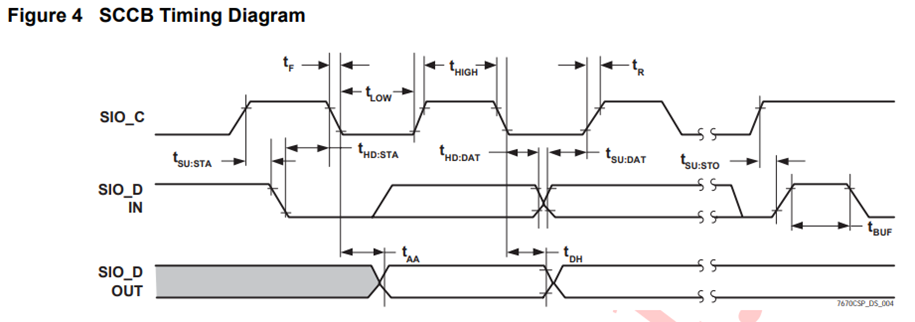</br>
   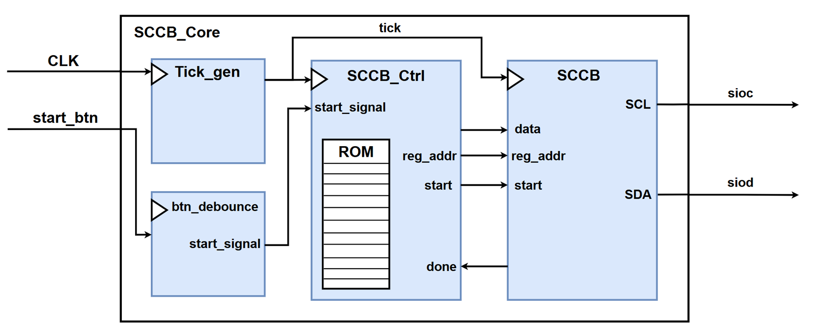</br>

### GRAPIC Block
- Block Design</br>
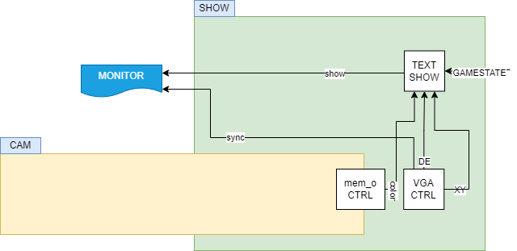</br>
#### Module Overview
- text_show<br/>
<table>
   <tr>
      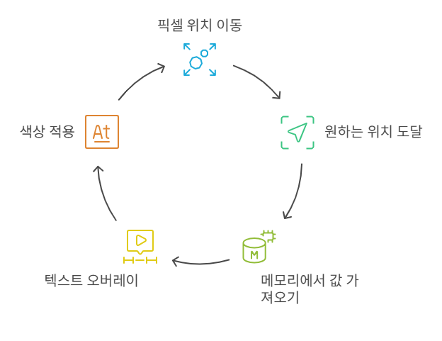
      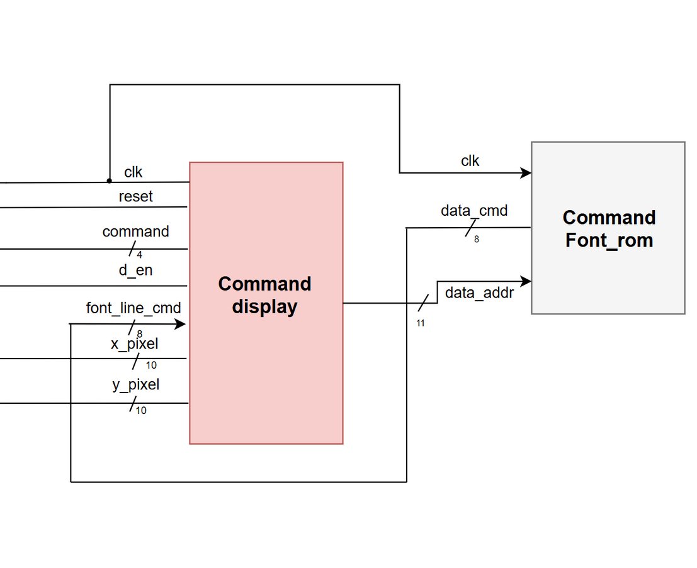
   </tr>
</table>

### GAME Block
- Block Design</br>
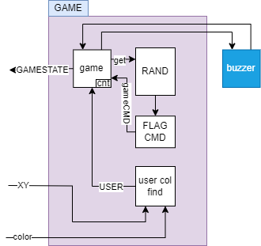</br>
#### Module Overview
- game_state</br>
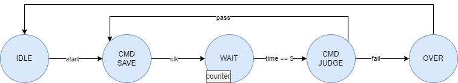</br>
- PRNG</br>
  - xorShift</br>
   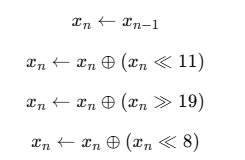</br>
  - seed set</br>
   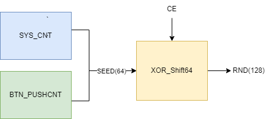</br>
- user color find</br>
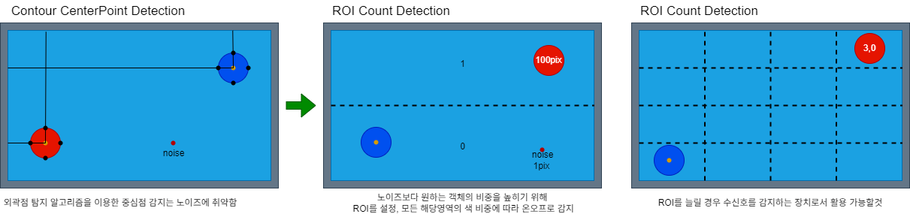</br>
   - color range</br>
   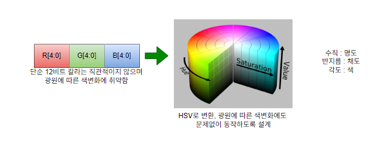</br>
   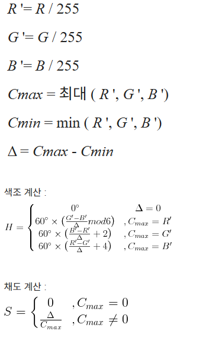</br>
   

## Circuit
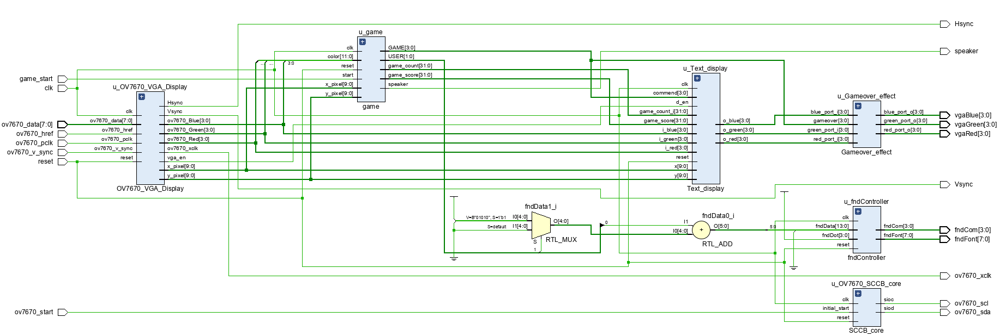</br>

## SIM
- PRNG</br>
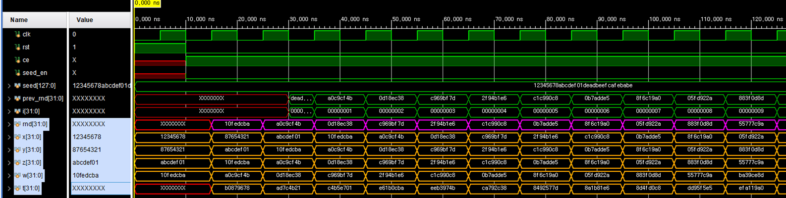</br>
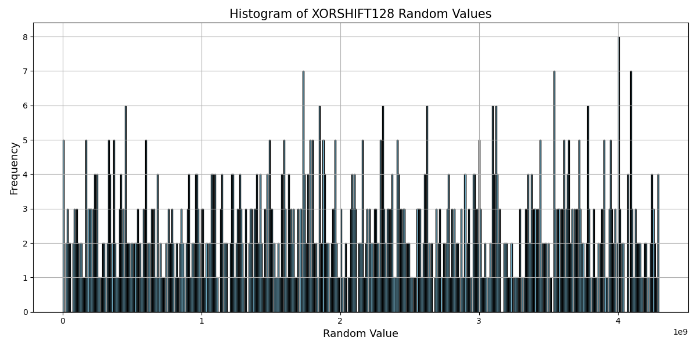</br>
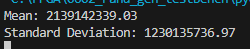</br>
- game_state</br>
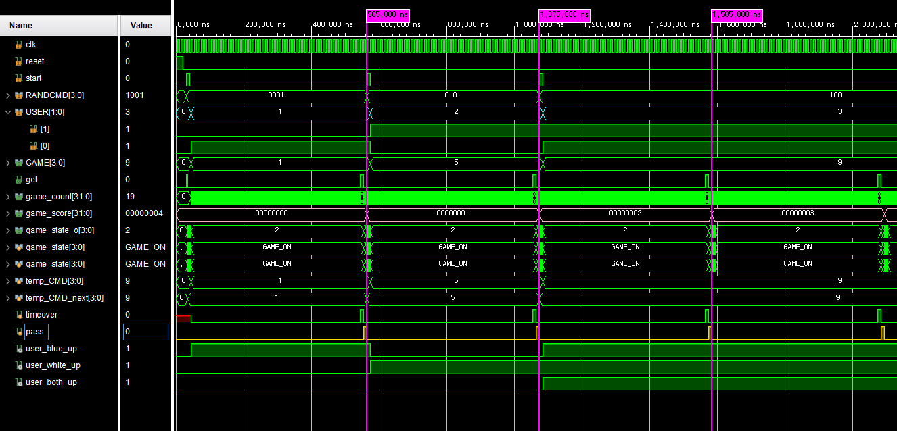</br>
- SCCB</br>
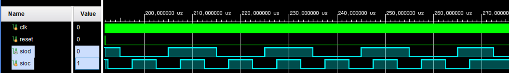</br>

## asset

<table>
   <tr>
      <td>Basys3</td>
      <td>OV7670</td>
      <td>MH-HMD</td>
   </tr>
   <tr>
      <td>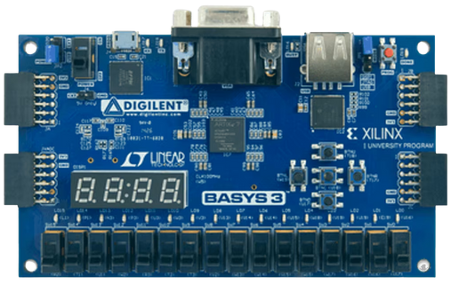</td>
      <td>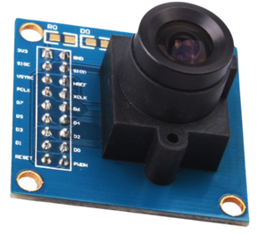</td>
      <td>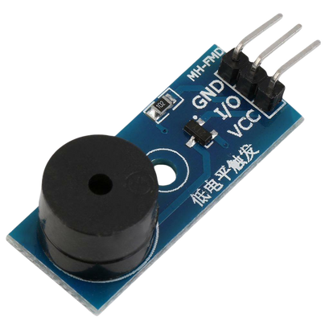</td>
   </tr>
</table>

## video  
click!--></br>
[](https://youtu.be/tyY2kQC33uQ)</br>

</br>

## 디렉토리 구조

```bash
project
├── FlagGame : ProjectMain
├── random_simulation_visualization : PRNG_Simulation
├── image : test_img
├── image_code : test_img_code
├── py : python_files
|   └── pyojun.py : PRNG 시뮬레이션 시각화 프로그램
├── SCCB : SCCB_module_demo
├── Text_display : Text_display_module_demo
└── Flag_cmd : cmd_gen_demo
```